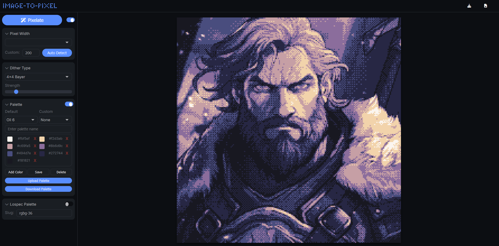
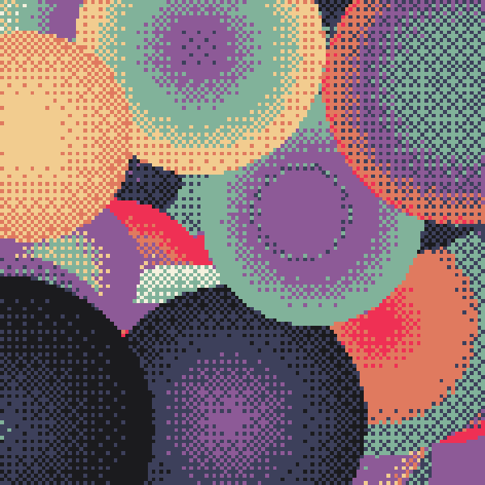

# 🎨 Image-to-Pixel

An intuitive editor for converting images into pixel art, applying dithering effects, and managing custom palettes!  
Available as both an interactive **application** and a **JavaScript API**. 

**👉 Try it live here**: [Image-to-Pixel Editor](https://tezumie.github.io/Image-to-Pixel/)

👴 Looking for the old editor? You can find it [here](https://aijs-code-editor-user-content.web.app/xCzvqwLDxaXjkLrxAeFpzGGnpTA2/Projects/Image-to-Pixel-Classic/index.html).



---

## 🚀 Application Features

**Version 2.0**  
V2 introduces enhanced speed, new features, and a refined interface:

- ⚡ **Highly Optimized**: Instant results for most images, even at larger sizes.
- 🔄 **Auto-Refresh Toggle**: See changes live as you tweak the settings.
- ✨ **Dithering Options**: Choose between `Floyd-Steinberg`,`2x2 Bayer`, `4x4 Bayer` and `Ordered`, and adjust dithering strength in real-time.
- 🎨 **Palette Support**: Use default palettes from Lospec or import custom ones via Lospec's API using a palette slug (e.g., `rgbg-36` from [Lospec Palette](https://lospec.com/palette-list/rgbg-36)).
- 💾 **Custom Palette Management**: Create custom palettes, save them to local cache, or download and upload them in JSON format.
- 📏 **Resolution Control**: Download your pixelated image at the input image’s resolution or as actual pixel art.
- 🔍 **Auto-Detect Image Size**: Easily set the pixel width to match the original image size (great for spritesheets).

---

## 🛠️ Using the API

You can use the `image-to-pixel` library in your own projects. Pass an image and options to the `pixelate` function, and get a beautifully dithered image in return.  
**Note**: The API is still a work in progress; official documentation is under development.

### Example Usage

Add the library to your project:

Use via CDN;
```html
<script src="https://cdn.jsdelivr.net/gh/Tezumie/Image-to-Pixel/dist/image-to-pixel.min.js"></script>
```

Or use locally (Recommended);
```html
<script src="image-to-pixel.js"></script>
```

### JavaScript Example
```js
ditheredCanvas = await pixelate({
  image: myCanvas,             // Accepts HTML canvas, image elements, or q5/p5.js image objects
  width: 128,                  // Set pixelation width
  dither: 'Floyd-Steinberg',   // Dithering method ('Floyd-Steinberg', 'Ordered','2x2 Bayer' or '4x4 Bayer')
  strength: 20,                // Dithering strength (0-100)
  //palette: 'rgbg-36',        // Optional: Lospec palette slug (depends on Lospec API availability)
  //Recommended: Define a custom palette //
  palette: [
    '#1b1b1e', '#f4f1de', '#e07a5f',
    '#3d405b', '#81b29a', '#f2cc8f',
    '#8d5a97', '#ef3054'
  ],
  resolution: 'original'       // Use 'original' for full resolution, or 'pixel' for pixelated size
});

```
Try a Demo Using image-to-pixel API with q5.js [here](https://aijs.io/editor?user=Tezumie&project=image-to-pixel-q5-p5).


---

## ❤️ Support

If you’d like to support the project, consider sharing your creations using the editor and tag me on Twitter [@tezumies](https://twitter.com/tezumies). Your feedback and shared art are greatly appreciated!

- For more pixel art goodness, check out the full-featured app [**Dither Dragon**](https://winterveil.itch.io/ditherdragon), offering even more options including animation support!  
- Want to contribute? Consider [becoming a patron](https://www.patreon.com/aijscodeeditor). Your support helps maintain and expand the project.

Happy pixelating! ✨
